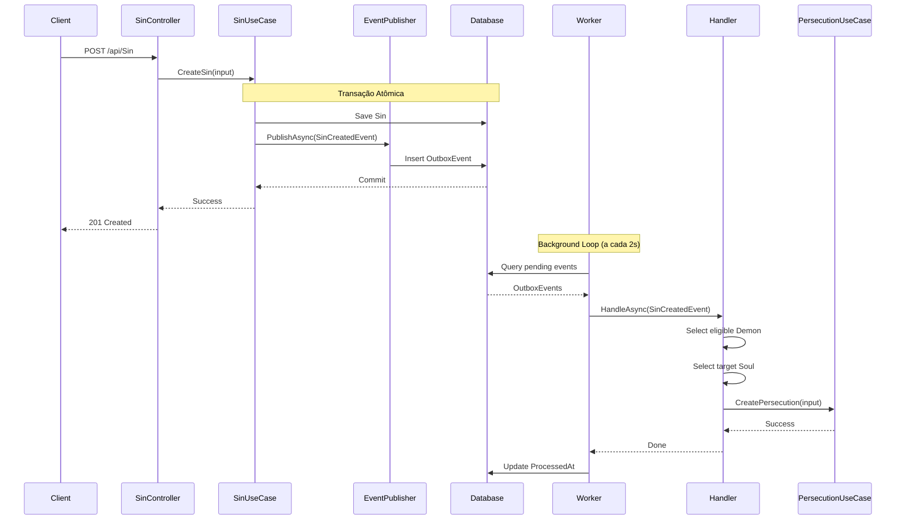

# Guia: Orquestrador de Perseguições com Eventos de Domínio

## 📚 Índice
1. [Conceitos Fundamentais](#conceitos-fundamentais)
2. [Arquitetura da Solução](#arquitetura-da-solução)
3. [Implementação Passo a Passo](#implementação-passo-a-passo)
4. [Patterns Utilizados](#patterns-utilizados)
5. [Boas Práticas](#boas-práticas)
6. [Referências e Links](#referências-e-links)

---

## 🎯 Objetivo

Implementar um sistema que **automaticamente** cria `Persecutions` quando um `Sin` de alta severidade é criado, usando eventos de domínio processados de forma assíncrona e confiável.

**Flow desejado:**
```
Sin criado (high/critical)
  ↓
Evento publicado no Outbox (transacional)
  ↓
Background Worker lê Outbox
  ↓
Handler/Orquestrador seleciona Demon + Soul
  ↓
Persecution criada automaticamente
```

---

## 📖 Conceitos Fundamentais

### 1. Domain Events (Eventos de Domínio)

**O que são?**
- Representam algo **que aconteceu** no domínio do negócio
- São imutáveis (records são perfeitos)
- Nome no passado: `SinCreated`, `SoulDamned`, `DemonAssigned`

**Por que usar?**
- Desacoplamento: `SinUseCase` não precisa conhecer `PersecutionUseCase`
- Extensibilidade: adicionar novos handlers sem modificar código existente
- Auditabilidade: eventos formam um log de tudo que aconteceu

**Exemplo no seu domínio:**
```csharp
public record SinCreatedEvent(
    Guid SinId,
    string SinName, 
    Severity Severity,
    DateTime OccurredAt
);
```

### 2. Outbox Pattern

**Problema que resolve:**
- Garantir que eventos sejam publicados **sempre** que a entidade é persistida
- Evitar perda de eventos em caso de falha
- Garantir consistência transacional

**Como funciona?**
1. Salvar entidade principal (`Sin`) + evento (`OutboxEvent`) na **mesma transação**
2. Worker processa eventos pendentes de forma assíncrona
3. Marca eventos como processados após sucesso

**Vantagens:**
- ✅ Confiabilidade: eventos nunca são perdidos
- ✅ Atomicidade: ambos salvam ou ambos falham
- ✅ Retry automático em caso de falha
- ✅ Ordem garantida (se necessário)

**Estrutura da tabela Outbox:**
```csharp
public class OutboxEvent
{
    public Guid Id { get; set; }
    public string Type { get; set; }          // Nome do tipo do evento
    public string Payload { get; set; }        // JSON serializado
    public DateTime CreatedAt { get; set; }
    public DateTime? ProcessedAt { get; set; } // null = pendente
    public int Attempts { get; set; }          // retry count
    public string? ErrorMessage { get; set; }  // último erro
}
```

### 3. Background Workers (IHostedService)

**O que são?**
- Serviços que rodam em segundo plano na aplicação ASP.NET
- Executam tarefas periódicas ou contínuas
- Compartilham o mesmo ciclo de vida da aplicação

**No nosso caso:**
- Lê eventos pendentes do Outbox
- Despacha para handlers apropriados
- Atualiza status do evento (processado/erro)

---

## 🏗️ Arquitetura da Solução

### Estrutura de Pastas Proposta

```
src/
├── Core/
│   ├── Domain/
│   │   ├── Events/
│   │   │   ├── IDomainEvent.cs
│   │   │   └── SinCreatedEvent.cs
│   │   └── Entities/
│   │       └── OutboxEvent.cs
│   │
│   └── Application/
│       ├── EventHandlers/
│       │   ├── IEventHandler.cs
│       │   └── SinCreatedHandler.cs
│       │
│       ├── Services/
│       │   ├── IEventPublisher.cs
│       │   ├── OutboxEventPublisher.cs
│       │   └── PersecutionOrchestrator.cs
│       │
│       └── Specifications/
│           ├── ISpecification.cs
│           └── EligibleDemonSpecification.cs
│
├── Adapters/
│   └── Outbound/
│       ├── Persistence/
│       │   └── OutboxRepository.cs
│       │
│       └── BackgroundWorkers/
│           └── OutboxDispatcherService.cs
│
└── Configuration/
    └── OutboxConfiguration.cs
```

### Fluxo Completo



---

## 🛠️ Implementação Passo a Passo

### Passo 1: Definir Interfaces Base

**src/Core/Domain/Events/IDomainEvent.cs**
```csharp
namespace Inferno.src.Core.Domain.Events;

public interface IDomainEvent
{
    Guid EventId { get; }
    DateTime OccurredAt { get; }
}
```

**src/Core/Application/EventHandlers/IEventHandler.cs**
```csharp
namespace Inferno.src.Core.Application.EventHandlers;

public interface IEventHandler<in TEvent> where TEvent : IDomainEvent
{
    Task HandleAsync(TEvent domainEvent, CancellationToken cancellationToken = default);
}
```

**src/Core/Application/Services/IEventPublisher.cs**
```csharp
namespace Inferno.src.Core.Application.Services;

public interface IEventPublisher
{
    Task PublishAsync<TEvent>(TEvent domainEvent) where TEvent : IDomainEvent;
}
```

---

### Passo 2: Criar Evento de Domínio

**src/Core/Domain/Events/SinCreatedEvent.cs**
```csharp
using Inferno.src.Core.Domain.Enums;

namespace Inferno.src.Core.Domain.Events;

public record SinCreatedEvent(
    Guid SinId,
    string SinName,
    Severity Severity,
    DateTime OccurredAt,
    Guid EventId = default
) : IDomainEvent
{
    public Guid EventId { get; init; } = EventId == default ? Guid.NewGuid() : EventId;
}
```

**Pesos de Severidade (para priorização):**
```csharp
public static class SeverityWeights
{
    public static int GetWeight(Severity severity) => severity switch
    {
        Severity.low => 1,
        Severity.medium => 2,
        Severity.high => 4,
        Severity.critical => 8,
        _ => 0
    };

    public static bool RequiresImmediateAction(Severity severity) 
        => severity is Severity.high or Severity.critical;
}
```

---

### Passo 3: Criar Entidade Outbox

**src/Core/Domain/Entities/OutboxEvent.cs**
```csharp
namespace Inferno.src.Core.Domain.Entities;

public class OutboxEvent
{
    public Guid Id { get; set; } = Guid.NewGuid();
    
    /// <summary>
    /// Tipo completo do evento (ex: "Inferno.src.Core.Domain.Events.SinCreatedEvent")
    /// </summary>
    public string Type { get; set; } = string.Empty;
    
    /// <summary>
    /// Evento serializado em JSON
    /// </summary>
    public string Payload { get; set; } = string.Empty;
    
    /// <summary>
    /// Quando o evento foi criado
    /// </summary>
    public DateTime CreatedAt { get; set; } = DateTime.UtcNow;
    
    /// <summary>
    /// Quando foi processado com sucesso (null = pendente)
    /// </summary>
    public DateTime? ProcessedAt { get; set; }
    
    /// <summary>
    /// Número de tentativas de processamento
    /// </summary>
    public int Attempts { get; set; } = 0;
    
    /// <summary>
    /// Última mensagem de erro (se houver)
    /// </summary>
    public string? ErrorMessage { get; set; }
}
```

**src/Configuration/OutboxConfiguration.cs**
```csharp
using Inferno.src.Core.Domain.Entities;
using Microsoft.EntityFrameworkCore;
using Microsoft.EntityFrameworkCore.Metadata.Builders;

namespace Inferno.src.Configuration;

public class OutboxConfiguration : IEntityTypeConfiguration<OutboxEvent>
{
    public void Configure(EntityTypeBuilder<OutboxEvent> builder)
    {
        builder.ToTable("OutboxEvents");
        
        builder.HasKey(x => x.Id);
        
        builder.Property(x => x.Type)
            .IsRequired()
            .HasMaxLength(500);
        
        builder.Property(x => x.Payload)
            .IsRequired();
        
        builder.Property(x => x.CreatedAt)
            .IsRequired();
        
        builder.Property(x => x.Attempts)
            .HasDefaultValue(0);
        
        builder.HasIndex(x => x.ProcessedAt)
            .HasFilter("[ProcessedAt] IS NULL"); // Index apenas em pendentes
        
        builder.HasIndex(x => x.CreatedAt);
    }
}
```

**Adicionar no HellDbContext:**
```csharp
public DbSet<OutboxEvent> OutboxEvents { get; set; }

protected override void OnModelCreating(ModelBuilder modelBuilder)
{
    // ... outras configurações
    modelBuilder.ApplyConfiguration(new OutboxConfiguration());
}
```

---

### Passo 4: Implementar Event Publisher

**src/Core/Application/Services/OutboxEventPublisher.cs**
```csharp
using System.Text.Json;
using Inferno.src.Adapters.Outbound.Repositories;
using Inferno.src.Core.Domain.Entities;
using Inferno.src.Core.Domain.Events;

namespace Inferno.src.Core.Application.Services;

public class OutboxEventPublisher : IEventPublisher
{
    private readonly HellDbContext _context;
    private readonly ILogger<OutboxEventPublisher> _logger;

    public OutboxEventPublisher(HellDbContext context, ILogger<OutboxEventPublisher> logger)
    {
        _context = context;
        _logger = logger;
    }

    public async Task PublishAsync<TEvent>(TEvent domainEvent) where TEvent : IDomainEvent
    {
        var outboxEvent = new OutboxEvent
        {
            Type = typeof(TEvent).AssemblyQualifiedName!, // Nome completo do tipo
            Payload = JsonSerializer.Serialize(domainEvent, new JsonSerializerOptions 
            { 
                WriteIndented = false 
            }),
            CreatedAt = DateTime.UtcNow
        };

        _context.OutboxEvents.Add(outboxEvent);
        await _context.SaveChangesAsync();

        _logger.LogInformation(
            "Event published to Outbox: {EventType} with Id {EventId}",
            typeof(TEvent).Name,
            domainEvent.EventId
        );
    }
}
```

---

### Passo 5: Background Worker (Dispatcher)

**src/Adapters/Outbound/BackgroundWorkers/OutboxDispatcherService.cs**
```csharp
using System.Text.Json;
using Inferno.src.Adapters.Outbound.Repositories;
using Inferno.src.Core.Application.EventHandlers;
using Inferno.src.Core.Domain.Events;
using Microsoft.EntityFrameworkCore;

namespace Inferno.src.Adapters.Outbound.BackgroundWorkers;

public class OutboxDispatcherService : BackgroundService
{
    private readonly IServiceProvider _serviceProvider;
    private readonly ILogger<OutboxDispatcherService> _logger;
    private const int BatchSize = 50;
    private const int PollingIntervalSeconds = 2;
    private const int MaxRetries = 5;

    public OutboxDispatcherService(
        IServiceProvider serviceProvider,
        ILogger<OutboxDispatcherService> logger)
    {
        _serviceProvider = serviceProvider;
        _logger = logger;
    }

    protected override async Task ExecuteAsync(CancellationToken stoppingToken)
    {
        _logger.LogInformation("Outbox Dispatcher Service started");

        while (!stoppingToken.IsCancellationRequested)
        {
            try
            {
                await ProcessPendingEventsAsync(stoppingToken);
            }
            catch (Exception ex)
            {
                _logger.LogError(ex, "Error processing outbox events");
            }

            await Task.Delay(TimeSpan.FromSeconds(PollingIntervalSeconds), stoppingToken);
        }

        _logger.LogInformation("Outbox Dispatcher Service stopped");
    }

    private async Task ProcessPendingEventsAsync(CancellationToken cancellationToken)
    {
        using var scope = _serviceProvider.CreateScope();
        var context = scope.ServiceProvider.GetRequiredService<HellDbContext>();

        var pendingEvents = await context.OutboxEvents
            .Where(x => x.ProcessedAt == null && x.Attempts < MaxRetries)
            .OrderBy(x => x.CreatedAt)
            .Take(BatchSize)
            .ToListAsync(cancellationToken);

        if (pendingEvents.Count == 0)
            return;

        _logger.LogInformation("Processing {Count} pending events", pendingEvents.Count);

        foreach (var outboxEvent in pendingEvents)
        {
            try
            {
                await DispatchEventAsync(outboxEvent, scope.ServiceProvider, cancellationToken);
                
                outboxEvent.ProcessedAt = DateTime.UtcNow;
                outboxEvent.ErrorMessage = null;
                
                _logger.LogInformation(
                    "Successfully processed event {EventId} of type {Type}",
                    outboxEvent.Id,
                    outboxEvent.Type
                );
            }
            catch (Exception ex)
            {
                outboxEvent.Attempts++;
                outboxEvent.ErrorMessage = ex.Message;
                
                _logger.LogError(
                    ex,
                    "Failed to process event {EventId} (Attempt {Attempts}/{MaxRetries})",
                    outboxEvent.Id,
                    outboxEvent.Attempts,
                    MaxRetries
                );
            }

            await context.SaveChangesAsync(cancellationToken);
        }
    }

    private async Task DispatchEventAsync(
        OutboxEvent outboxEvent,
        IServiceProvider serviceProvider,
        CancellationToken cancellationToken)
    {
        var eventType = Type.GetType(outboxEvent.Type);
        if (eventType == null)
        {
            throw new InvalidOperationException($"Unknown event type: {outboxEvent.Type}");
        }

        // Deserializar o evento
        var domainEvent = JsonSerializer.Deserialize(outboxEvent.Payload, eventType);
        if (domainEvent == null)
        {
            throw new InvalidOperationException("Failed to deserialize event");
        }

        // Obter o tipo do handler
        var handlerType = typeof(IEventHandler<>).MakeGenericType(eventType);
        var handler = serviceProvider.GetService(handlerType);

        if (handler == null)
        {
            _logger.LogWarning("No handler registered for event type {EventType}", eventType.Name);
            return;
        }

        // Invocar o handler
        var handleMethod = handlerType.GetMethod(nameof(IEventHandler<IDomainEvent>.HandleAsync));
        if (handleMethod != null)
        {
            var task = (Task)handleMethod.Invoke(handler, new[] { domainEvent, cancellationToken })!;
            await task;
        }
    }
}
```

---

### Passo 6: Implementar Handler/Orquestrador

**src/Core/Application/EventHandlers/SinCreatedHandler.cs**
```csharp
using Inferno.src.Core.Application.DTOs.Request.Persecution;
using Inferno.src.Core.Domain.Entities;
using Inferno.src.Core.Domain.Events;
using Inferno.src.Core.Domain.Interfaces.Repository.Demon;
using Inferno.src.Core.Domain.Interfaces.Repository.Soul;
using Inferno.src.Core.Domain.Interfaces.UseCases;

namespace Inferno.src.Core.Application.EventHandlers;

public class SinCreatedHandler : IEventHandler<SinCreatedEvent>
{
    private readonly IDemonRepository _demonRepository;
    private readonly ISoulRepository _soulRepository;
    private readonly IPersecutionUseCase _persecutionUseCase;
    private readonly ILogger<SinCreatedHandler> _logger;

    public SinCreatedHandler(
        IDemonRepository demonRepository,
        ISoulRepository soulRepository,
        IPersecutionUseCase persecutionUseCase,
        ILogger<SinCreatedHandler> logger)
    {
        _demonRepository = demonRepository;
        _soulRepository = soulRepository;
        _persecutionUseCase = persecutionUseCase;
        _logger = logger;
    }

    public async Task HandleAsync(SinCreatedEvent domainEvent, CancellationToken cancellationToken = default)
    {
        _logger.LogInformation(
            "Handling SinCreatedEvent: {SinId} with severity {Severity}",
            domainEvent.SinId,
            domainEvent.Severity
        );

        // Verificar se requer ação imediata
        if (!SeverityWeights.RequiresImmediateAction(domainEvent.Severity))
        {
            _logger.LogInformation(
                "Sin {SinId} has low severity, skipping automatic persecution",
                domainEvent.SinId
            );
            return;
        }

        // Selecionar Demon elegível
        var demon = await SelectEligibleDemonAsync(domainEvent, cancellationToken);
        if (demon == null)
        {
            _logger.LogWarning(
                "No eligible demon found for sin {SinId}. Should add to waitlist.",
                domainEvent.SinId
            );
            // TODO: Adicionar à fila de espera
            return;
        }

        // Selecionar Soul alvo
        var soul = await SelectTargetSoulAsync(cancellationToken);
        if (soul == null)
        {
            _logger.LogWarning(
                "No target soul available for persecution. Should defer processing."
            );
            // TODO: Adicionar à fila de processamento futuro
            return;
        }

        // Criar Persecution
        try
        {
            var input = new PersecutionInput
            {
                IdDemon = demon.IdDemon,
                IdSoul = soul.IdSoul
            };

            var (response, message) = await _persecutionUseCase.CreatePersecution(input);
            
            _logger.LogInformation(
                "Persecution created successfully: Demon {DemonId} → Soul {SoulId} (Sin {SinId})",
                demon.IdDemon,
                soul.IdSoul,
                domainEvent.SinId
            );
        }
        catch (Exception ex)
        {
            _logger.LogError(
                ex,
                "Failed to create persecution for sin {SinId}",
                domainEvent.SinId
            );
            throw; // Relanç ar para retry
        }
    }

    private async Task<Demon?> SelectEligibleDemonAsync(
        SinCreatedEvent evt,
        CancellationToken cancellationToken)
    {
        // Estratégia simples: buscar todos e selecionar o primeiro
        // TODO: Implementar ISpecification<Demon> para regras complexas
        var allDemons = await _demonRepository.GetAllAsync();
        
        // Regras de elegibilidade:
        // - Demon deve estar disponível
        // - Demon deve ter categoria compatível com a severidade
        // - Demon não deve estar sobrecarregado
        
        var candidates = allDemons
            .Where(d => d.Category != null) // Tem categoria
            .OrderByDescending(ScoreDemon) // Pontuação customizada
            .ToList();

        return candidates.FirstOrDefault();
    }

    private int ScoreDemon(Demon demon)
    {
        // Pontuação baseada em:
        // - Categoria (algumas categorias são mais adequadas)
        // - Disponibilidade (número atual de perseguições)
        // - Antiguidade (demons mais antigos têm prioridade)
        
        int score = 0;
        
        // Exemplo: demons mais antigos ganham pontos
        var daysSinceCreation = (DateTime.UtcNow - demon.Birth).Days;
        score += Math.Min(daysSinceCreation / 10, 100);
        
        // TODO: Adicionar mais critérios conforme necessário
        
        return score;
    }

    private async Task<Soul?> SelectTargetSoulAsync(CancellationToken cancellationToken)
    {
        // Estratégia: selecionar alma de nível mais alto sem perseguição recente
        // TODO: Implementar lógica mais sofisticada
        
        var allSouls = await _soulRepository.GetAllAsync();
        
        return allSouls
            .OrderByDescending(s => s.Level) // Superior > Medio > Inferior
            .ThenBy(s => Guid.NewGuid()) // Aleatoriedade
            .FirstOrDefault();
    }
}
```

---

### Passo 7: Publicar Evento no Use Case

**Modificar src/Core/Application/UseCases/Sin/SinUseCase.cs:**

```csharp
using Inferno.src.Core.Application.Services;
using Inferno.src.Core.Domain.Events;

public class SinUseCase : ISinUseCase
{
    private readonly ISinRepository _context;
    private readonly ILogger<SinUseCase> _logger;
    private readonly IEventPublisher _eventPublisher; // NOVO

    public SinUseCase(
        ISinRepository context, 
        ILogger<SinUseCase> logger,
        IEventPublisher eventPublisher) // NOVO
    {
        _context = context;
        _logger = logger;
        _eventPublisher = eventPublisher; // NOVO
    }

    public async Task<(SinResponse response, string message)> CreateSin(SinInput input)
    {
        _logger.LogInformation(
            "Starting CreateSin operation with SinName: {SinName}, Severity: {Severity}",
            input.SinName,
            input.SinSeverity
        );

        var sin = new Entity.Sin(input.SinName, input.SinSeverity);
        await _context.Create(sin);

        // NOVO: Publicar evento de domínio
        await _eventPublisher.PublishAsync(new SinCreatedEvent(
            sin.IdSin,
            sin.SinName,
            sin.SinSeverity,
            DateTime.UtcNow
        ));

        var message = $"Successfully created sin with properties {sin.IdSin},{sin.SinName},{sin.SinSeverity}";
        _logger.LogInformation(
            "Sin created successfully with ID: {SinId}, Name: {SinName}",
            sin.IdSin,
            sin.SinName
        );

        return (new SinResponse(sin.IdSin, sin.SinName, sin.SinSeverity), message);
    }
}
```

---

### Passo 8: Registrar no DI (Program.cs)

```csharp
// Event Publishing
builder.Services.AddScoped<IEventPublisher, OutboxEventPublisher>();

// Event Handlers
builder.Services.AddScoped<IEventHandler<SinCreatedEvent>, SinCreatedHandler>();

// Background Workers
builder.Services.AddHostedService<OutboxDispatcherService>();
```

---

### Passo 9: Migration

```powershell
# Criar migration
dotnet ef migrations add AddOutboxEvents

# Aplicar
dotnet ef database update
```

---

## 🎯 Patterns Utilizados

### 1. **Outbox Pattern**
- **Problema:** Garantir consistência entre DB e eventos
- **Solução:** Salvar eventos na mesma transação do aggregate

### 2. **Specification Pattern**
- **Problema:** Regras de seleção complexas e reutilizáveis
- **Solução:** Encapsular critérios em objetos `ISpecification<T>`

```csharp
public interface ISpecification<T>
{
    bool IsSatisfiedBy(T entity);
}

public class EligibleDemonSpecification : ISpecification<Demon>
{
    private readonly Severity _severity;

    public EligibleDemonSpecification(Severity severity)
    {
        _severity = severity;
    }

    public bool IsSatisfiedBy(Demon demon)
    {
        // Lógica de elegibilidade
        return demon.Category != null 
            && /* outras regras */;
    }
}
```

### 3. **Strategy Pattern**
- **Problema:** Diferentes estratégias de seleção de Demon/Soul
- **Solução:** Interfaces `IDemonSelectionStrategy`, `ISoulSelectionStrategy`

### 4. **Retry Pattern**
- **Problema:** Falhas transitórias no processamento
- **Solução:** Contador de tentativas + backoff exponencial

---

## ✅ Boas Práticas

### 1. **Idempotência**
Garanta que processar o mesmo evento múltiplas vezes não cause duplicação:

```csharp
// Adicionar constraint unique em Persecution
builder.HasIndex(x => new { x.IdDemon, x.IdSoul })
    .IsUnique()
    .HasDatabaseName("IX_Persecution_Demon_Soul_Unique");
```

### 2. **Observabilidade**

```csharp
// Logs estruturados
_logger.LogInformation(
    "Processing event {EventId} of type {EventType} (Attempt {Attempt})",
    eventId,
    eventType,
    attemptCount
);

// Métricas (se usar Application Insights ou similar)
_telemetryClient.TrackMetric("OutboxEvents.Pending", pendingCount);
_telemetryClient.TrackMetric("OutboxEvents.ProcessingTime", duration.TotalMilliseconds);
```

### 3. **Tratamento de Erros**

```csharp
// Diferentes estratégias por tipo de erro
catch (DbUpdateException ex)
{
    // Conflito de constraint (idempotência) - não retentar
    if (ex.InnerException?.Message.Contains("UNIQUE") == true)
    {
        _logger.LogWarning("Duplicate persecution detected, marking as processed");
        outboxEvent.ProcessedAt = DateTime.UtcNow;
    }
}
catch (HttpRequestException ex)
{
    // Erro de rede - retentar com backoff
    await Task.Delay(TimeSpan.FromSeconds(Math.Pow(2, outboxEvent.Attempts)));
    throw;
}
```

### 4. **Performance**

```csharp
// Processamento em lote
var batch = pendingEvents.Take(50);
var tasks = batch.Select(e => ProcessEventAsync(e));
await Task.WhenAll(tasks);

// Índices apropriados
builder.HasIndex(x => x.ProcessedAt)
    .HasFilter("[ProcessedAt] IS NULL"); // Apenas pendentes
```

### 5. **Testes**

```csharp
[Fact]
public async Task SinCreated_HighSeverity_ShouldCreatePersecution()
{
    // Arrange
    var sin = new Sin("Greed", Severity.high);
    var demon = new Demon { IdDemon = Guid.NewGuid() };
    var soul = new Soul { IdSoul = Guid.NewGuid() };
    
    // Act
    await _sinUseCase.CreateSin(new SinInput { /* ... */ });
    await _dispatcher.ProcessPendingEventsAsync(); // Forçar processamento
    
    // Assert
    var persecution = await _context.Persecutions
        .FirstOrDefaultAsync(p => p.IdDemon == demon.IdDemon);
    
    Assert.NotNull(persecution);
}
```

---

## 📚 Referências e Links

### Artigos e Documentação

1. **Outbox Pattern**
   - [Microsoft: Outbox Pattern](https://learn.microsoft.com/en-us/azure/architecture/best-practices/transactional-outbox-cosmos)
   - [Martin Fowler: Event-Driven Architecture](https://martinfowler.com/articles/201701-event-driven.html)

2. **Domain Events**
   - [Microsoft: Domain Events](https://learn.microsoft.com/en-us/dotnet/architecture/microservices/microservice-ddd-cqrs-patterns/domain-events-design-implementation)
   - [Vladimir Khorikov: Domain Events](https://enterprisecraftsmanship.com/posts/domain-events-simple-reliable-solution/)

3. **Background Services**
   - [Microsoft: Hosted Services](https://learn.microsoft.com/en-us/aspnet/core/fundamentals/host/hosted-services)
   - [Background Tasks in ASP.NET Core](https://learn.microsoft.com/en-us/aspnet/core/fundamentals/host/hosted-services?view=aspnetcore-8.0)

4. **Specification Pattern**
   - [Martin Fowler: Specification](https://martinfowler.com/apsupp/spec.pdf)
   - [Ardalis: Specification Pattern](https://github.com/ardalis/Specification)

### Bibliotecas Úteis (Opcionais)

```bash
# MediatR (alternativa ao dispatcher manual)
dotnet add package MediatR

# Polly (retry policies)
dotnet add package Polly

# Quartz.NET (scheduling mais robusto)
dotnet add package Quartz
```

### Vídeos Recomendados

- [Event-Driven Architecture - Milan Jovanović](https://www.youtube.com/watch?v=gXz4cq3PKdg)
- [Implementing the Outbox Pattern - CodeOpinion](https://www.youtube.com/watch?v=XALvnX7MPeo)
- [Domain Events in DDD - Nick Chapsas](https://www.youtube.com/watch?v=h3sWbP5iXHk)

---

## 🚀 Próximos Passos Sugeridos

### Fase 1: MVP (Básico Funcional)
- ✅ Outbox + Publisher
- ✅ Dispatcher básico
- ✅ Handler simples (random demon/soul)

### Fase 2: Regras de Negócio
- 📊 Specification para elegibilidade
- 🎯 Estratégias de seleção sofisticadas
- 📈 Score/peso por severidade

### Fase 3: Resiliência
- 🔄 Retry com backoff exponencial
- 🛡️ Circuit breaker (Polly)
- 📊 Dead letter queue

### Fase 4: Observabilidade
- 📊 Métricas (Application Insights)
- 🔍 Distributed tracing
- 📈 Dashboard de monitoramento

### Fase 5: Otimizações
- ⚡ Processamento paralelo
- 💾 Caching de demons/souls elegíveis
- 🎲 Load balancing entre demons

---

## ❓ FAQ

**Q: Por que não usar MediatR?**
A: MediatR é ótimo, mas adiciona complexidade. Começar "na mão" te ensina os fundamentos. Depois você pode migrar.

**Q: E se o worker cair no meio do processamento?**
A: O Outbox garante: se `ProcessedAt` está null, será reprocessado. Daí a importância da idempotência.

**Q: Como evitar duplicação de Persecution?**
A: Constraint unique `(IdDemon, IdSoul)` + try/catch na inserção.

**Q: Polling a cada 2s não é ineficiente?**
A: Para MVP sim. Depois use SignalR, Redis Pub/Sub ou RabbitMQ.

**Q: Como testar o handler isoladamente?**
A: Mock dos repositories + assert nas calls. O evento é só um record, fácil de instanciar.

---

## 🎓 Conclusão

Você está implementando padrões **avançados** usados em sistemas distribuídos de produção. Este é um excelente exercício para:

- Entender **event-driven architecture**
- Praticar **DDD** (agregados, eventos de domínio)
- Aprender **resiliência** (retry, idempotência)
- Ganhar experiência com **background processing**

**Próximo passo imediato:**
1. Criar a migration do Outbox
2. Implementar o publisher
3. Modificar `SinUseCase.CreateSin()` para publicar o evento
4. Testar manualmente criando um Sin e verificando a tabela Outbox

Depois disso, implemente o dispatcher e o handler básico.

**Boa sorte! 🔥**
